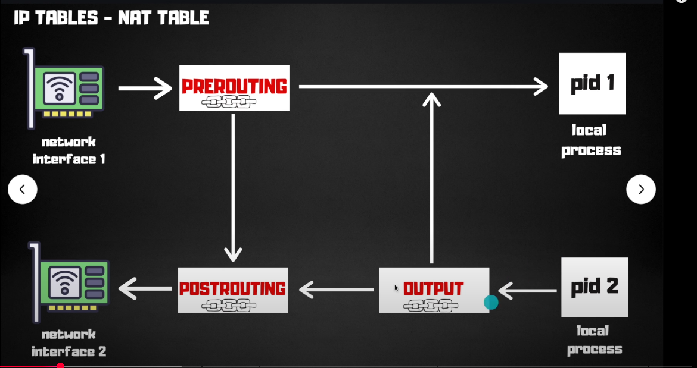

# IPTables

### 3 Main Concepts

1. Tables: Different tables for different types of processing (filter, nat, mangle, raw, security)
2. Chains: PreRouting, Predefined chains (INPUT, OUTPUT, FORWARD), PostRouting
3. Rules: Individual rules that specify what to do with packets (ACCEPT, DROP, REJECT, etc.)

#### Tables

1. **filter**: Default table for packet filtering
2. **nat**: Used for Network Address Translation
   1. To change source/destination IP addresses
3. **mangle**: Used for specialized packet alteration
   1. To handle ip header options
4. **raw**: Used for configuring exemptions from connection tracking
5. **security**: Used for Mandatory Access Control (MAC) networking rules

#### Chains

1. **PREROUTING**: Alters packets as soon as they come in
2. **INPUT**: Filters packets destined for the local system
3. **FORWARD**: Filters packets being routed through the system
4. **OUTPUT**: Filters packets generated by the local system
5. **POSTROUTING**: Alters packets as they are about to leave the system


#### Rules

Rules are the individual entries in a chain that specify what to do with packets that match certain criteria. Each rule consists of:
- **Criteria**: Conditions that a packet must meet to match the rule (e.g., source/destination IP, port, protocol)
- **Target**: The action to take if the packet matches the criteria (e.g., ACCEPT, DROP, REJECT, LOG)
- **Options**: Additional parameters that modify the behavior of the rule (e.g., logging options, rate limiting)
- **Examples**:
  - Accept all incoming SSH traffic:
    ```bash
    iptables -A INPUT -p tcp --dport 22 -j ACCEPT
    ```

#### Basic Commands

- List rules:
  ```bash
  iptables -L -n -v
  ```


### Working Example

#### NAT Table



This redirects based on port 80 to port 8080
```bash
sudo iptables -t nat -A PREROUTING -p tcp --dport 80 -j REDIRECT --to 8080
```